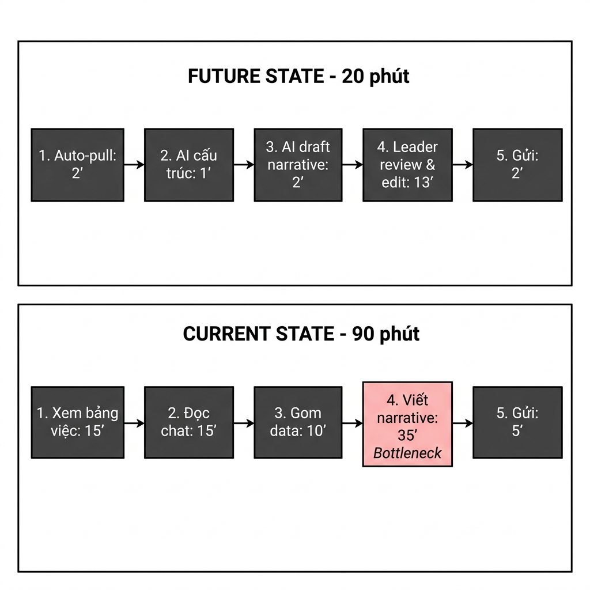

# 02 — Group Problem Statement

## Thành viên nhóm

| STT | Họ và tên | Mã học viên | Vai trò trong nhóm |
|-----|-----------|-------------|--------------------|
| 1   | Đinh Hoàng Quân | 2A202602034 | Team Leader |
| 2   | Trịnh Hoàng Nam | 2A202601376 | Member |
| 3   | Vũ Bảo Chinh | 2A202601448 | Member |
| 4   | Nguyễn Thành Vinh | 2A202601556 | Member |
| 5   | Hoàng Thanh Sơn | 2A202601848 | Member |

---

## Group convergence

Nhóm 5 người, mỗi người share top 3 problems. Tổng cộng 15 candidates (lược thành 12 candidates chính để phân cụm).

| # | Người đưa ra | Candidate problem | Người gặp vấn đề | Điểm nghẽn | Cảm nhận nhanh |
|---|---|---|---|---|---|
| 1 | Hoàng Thanh Sơn | Mỗi cuối tuần phải thu thập tin nhắn, file cập nhật và ghi chú từ các thành viên để tổng hợp báo cáo tiến độ tuần của nhóm | Team Leader, Các thành viên | Gom dữ liệu thô & viết narrative tóm tắt (35 phút) | Workflow rất rõ, tốn thời gian cố định mỗi tuần. |
| 2 | Hoàng Thanh Sơn | Đọc và tóm tắt tài liệu đề cương học tập / báo cáo dài (20-30 trang) trước khi họp/ôn thi | Sinh viên, Nhân viên | Trích xuất ý chính & danh sách việc cần làm (30 phút) | Pain point thực tế nhưng metric chất lượng khó đo. |
| 3 | Hoàng Thanh Sơn | Nghe lại file ghi âm cuộc họp online 1-2 tiếng để viết Meeting Recap & Action Items | Thư ký, Team Leader | Nghe lại ghi âm và lọc thông tin phân công (25 phút) | Rất phổ biến, AI Speech-to-Text hỗ trợ tốt. |
| 4 | Trịnh Hoàng Nam | Theo dõi và nhập liệu thu chi quỹ nhóm từ ảnh hóa đơn | Trưởng quỹ nhóm | Gõ từng dòng số tiền & tên món đồ thủ công (25 phút) | Có thể giải bằng Rule/OCR đơn giản. |
| 5 | Trịnh Hoàng Nam | Lên kế hoạch ăn uống, lịch trình và chia tiền chuyến đi cho nhóm đông | Trưởng nhóm ăn uống | Gom nguyện vọng & tính tiền chia lẻ từ nhiều hóa đơn (40 phút) | Ít lặp lại hằng tuần (tùy dịp đi chơi). |
| 6 | Trịnh Hoàng Nam | Lập lịch biểu công việc tuần và sắp xếp ưu tiên deadline trùng nhau | Sinh viên, Người đi làm | Phân bổ thời gian và đánh giá độ ưu tiên task (30 phút) | Khó xác định boundary vì thuộc quản lý cá nhân. |
| 7 | Vũ Bảo Chinh | Tra cứu các quyết định cũ và file tài liệu bị trôi trong kênh chat nhóm | Thành viên nhóm | Tìm từ khóa không ra ngữ cảnh cũ (15 phút/lần) | Cần tích hợp RAG/Bot, data access rộng. |
| 8 | Vũ Bảo Chinh | Trả lời lặp đi lặp lại các câu hỏi thắc mắc của thành viên mới về quy trình nhóm | Mentor, Leader | Tìm link cũ và gõ lại câu trả lời bị trùng (10 phút/câu) | Rất đau ở mảng giao tiếp, có thể làm RAG Bot. |
| 9 | Vũ Bảo Chinh | Rà soát yêu cầu đề bài đồ án / hợp đồng để lập danh sách kiểm tra (Checklist) | Sinh viên, Dev | Đọc văn bản dài và phân tách yêu cầu ẩn (30 phút) | Phù hợp làm prompt/workflow đơn giản. |
| 10 | Nguyễn Thành Vinh | Tổng hợp phản hồi / feedback của người dùng từ các kênh khảo sát lẻ | Product Analyst | Đọc từng comment và gán nhãn chủ đề thủ công (45 phút) | Pain thật nhưng phụ thuộc dữ liệu bên ngoài. |
| 11 | Nguyễn Thành Vinh | Nhắc nhở thành viên cập nhật tiến độ công việc trước giờ họp | Thư ký nhóm | Nhắn tin giục từng người điền báo cáo (20 phút) | Nhắc nhở chỉ cần Bot/Rule cơ bản. |
| 12 | Nguyễn Thành Vinh | Soạn thảo email thông báo sự kiện / nội quy mới cho toàn thể nhóm | Admin nhóm | Chỉnh sửa văn phong và kiểm tra đủ thông tin (25 phút) | Tần suất không quá cao. |

### Gom trùng / Phân cụm (Cluster)

| Cluster | Candidates included | Pattern chung | Ghi chú |
|---|---|---|---|
| **Báo cáo / Tổng hợp thông tin** | Candidates 1, 3, 10 | Gom thông tin rải rác từ nhiều nguồn để viết bài tóm tắt / báo cáo cho người khác xem | Workflow rõ ràng, dễ đo lường impact thời gian |
| **Tìm kiếm / Hỏi đáp tài liệu** | Candidates 7, 8 | Tìm kiếm thông tin cũ và trả lời thắc mắc lặp đi lặp lại trong kênh chat | Liên quan đến tri thức nhóm (Knowledge base/RAG) |
| **Lên kế hoạch / Lịch biểu** | Candidates 5, 6, 11 | Nhắc nhở, sắp xếp công việc và phân bổ lịch biểu | Đa số có thể giải bằng Rule hoặc Bot nhắc nhở đơn giản |
| **Đọc hiểu / Review** | Candidates 2, 4, 9, 12 | Đọc văn bản/hóa đơn dài để trích xuất dữ liệu hoặc viết nội dung mới | AI hỗ trợ tốt nhưng scope bài toán dễ bị mở rộng |

---

## Shortlist và score

| Candidate | Actor rõ | Workflow rõ | Pain có evidence | Impact đo được | Làm trong lab | So sánh R/W/A được | Nhóm hiểu domain | Tổng |
|---|---:|---:|---:|---:|---:|---:|---:|---:|
| **Weekly Progress Report** | 5 | 5 | 5 | 5 | 5 | 5 | 5 | **35** |
| **Meeting Recap** | 5 | 4 | 4 | 4 | 4 | 4 | 5 | **30** |
| **FAQ Support Bot** | 4 | 4 | 4 | 4 | 3 | 4 | 4 | **27** |

Nhóm chọn: **Weekly Progress Report (Tổng hợp báo cáo tiến độ tuần của nhóm)**.

Vì sao chọn:

- Có workflow rõ nhất, diễn ra đều đặn hàng tuần.
- Có baseline thời gian rõ ràng (90 phút/lần).
- Bài toán thể hiện rõ điểm nghẽn ở bước tổng hợp narrative tiến độ & rủi ro.
- Dễ dàng so sánh giữa phương án No AI / Rule / Workflow / Agent.
- Tính khả thi cao trong thời lượng buổi lab.

Vì sao không chọn các bài khác:

- **Meeting Recap:** Phụ thuộc nhiều vào chất lượng âm thanh file ghi âm họp online và độ chính xác của công cụ chuyển giọng nói thành văn bản (STT).
- **FAQ Support Bot:** Cần hạ tầng RAG Bot và quản lý phân quyền dữ liệu phức tạp hơn phạm vi bài lab.

---

## Quick validation

Nhóm phỏng vấn nhanh 3 Quản lý/Trưởng nhóm và làm mini survey với 8 thành viên nhóm đồ án.

| Nguồn | Số người | Tín hiệu xác nhận | Tín hiệu phản bác | Nhóm sửa problem thế nào |
|---|---:|---|---|---|
| Quick interview | 3 | 3/3 người khẳng định mất từ 60-90 phút/tuần; bước mệt nhất là tổng hợp narrative tiến độ & rủi ro | 1 người góp ý: Dashboard tự động xuất số liệu đã có sẵn | Thu hẹp phạm vi: Tập trung vào việc **draft đoạn văn narrative tóm tắt tiến độ & rủi ro**, không làm phần dashboard số liệu thô |
| Mini survey | 8 | 7/8 người thừa nhận từng gửi báo cáo tuần trễ deadline vì ngại gõ đoạn tóm tắt tiến độ | 2 người lo ngại AI tự viết báo cáo sẽ sinh thông tin không đúng sự thật | Đưa **Human-in-the-loop (Người kiểm duyệt)** làm bước bắt buộc: AI chỉ draft, Leader review & bấm gửi |

Insight sau validation:

```text
Pain thật không nằm ở việc "lấy số" đơn thuần. Pain nằm ở đoạn biến nhiều nguồn thông tin rải rác thành narrative đủ rõ cho người khác ra quyết định.
```

---

## Research giải pháp

| Nguồn / tool / case | Link | Họ giải quyết phần nào? | Điểm mạnh | Khoảng trống / rủi ro | Bài học cho nhóm |
|---|---|---|---|---|---|
| Atlassian Jira Reports | https://www.atlassian.com/software/jira/features/reports | Tự động xuất biểu đồ tiến độ & số lượng ticket hoàn thành | Số liệu định lượng chuẩn xác, trực quan | Chỉ hiển thị biểu đồ khô cứng, không tự viết văn bản giải thích ngữ cảnh hay rủi ro | Dùng Rule/Script để tự động pull số liệu thô, dành AI cho phần narrative |
| Slack AI | https://slack.com/help/articles/25076892548883-Guide-to-Slack-AI | Tóm tắt các tin nhắn cập nhật trên kênh chat | Tóm tắt nhanh hội thoại giữa các thành viên | Chỉ tóm tắt trong Slack, không gom được dữ liệu từ bảng công việc/Sheets | Phải kết hợp nhiều nguồn dữ liệu (Multi-source integration) |
| Fellow.ai Meeting & Report | https://fellow.ai/features/ai | Tạo bản nháp báo cáo và danh sách việc cần làm | Giao diện quản lý báo cáo chuyên nghiệp | Chi phí bản quyền cao, chưa tùy chỉnh sâu theo form báo cáo riêng | Pattern thiết kế chuẩn: AI sinh bản nháp (Draft) ──► Người thật Review & Edit |

Research takeaway:

```text
Không nên build một agent tự chạy toàn bộ báo cáo ngay. Hướng hợp lý hơn là Workflow: tự động lấy/cấu trúc dữ liệu ở các bước rõ, dùng AI để draft narrative, Leader review trước khi gửi.
```

---

## Workflow before/after



Nội dung workflow:

```text
CURRENT STATE — 7 bước, 90 phút

[1 Xem bảng công việc: 15']
→ [2 Đọc tin nhắn nhóm chat: 15']
→ [3 Gom nốt cá nhân: 15']
→ [4 Gom dữ liệu thô vào file cũ: 10']
→ [5 Viết narrative tiến độ & rủi ro: 35']  <-- bottleneck
→ [6 Self-review & định dạng: 5']
→ [7 Gửi báo cáo: 5']

FUTURE STATE — 5 bước, 20 phút

[1 Auto-pull dữ liệu cập nhật: 2']        -- Rule/script
→ [2 AI cấu trúc & phân tích: 1']          -- Workflow step
→ [3 AI sinh bản nháp narrative: 2']       -- Workflow step
→ [4 Leader review & edit: 13']            -- Human boundary
→ [5 Leader duyệt & gửi: 2']

Fallback:
AI draft sai hoặc bị ảo thông tin → Leader bỏ draft và tự điền theo template truyền thống.

Bottleneck mới:
Leader review + edit. Đây là bottleneck chấp nhận được vì đó là điểm kiểm soát chất lượng (Human boundary).
```

Before/after impact:

| Metric | Trước | Sau kỳ vọng | Ghi chú |
|---|---:|---:|---|
| Tổng thời gian | 90 phút | 20 phút | Giảm 77% thời gian làm báo cáo |
| Số bước | 7 bước | 5 bước | Bỏ được các bước copy-paste thủ công |
| Bước thủ công | 6/7 bước | 2/5 bước | Leader vẫn review và gửi |
| Bottleneck chính | Viết narrative (35') | Review/edit (13') | Human boundary |
| Risk mới | Không có AI hallucination | Có hallucination risk nếu input thiếu | Cần Leader review trước khi gửi |

---

## Problem Statement v0

| Field | Nội dung |
|---|---|
| **Actor** | Team Leader / Người quản lý nhóm nhỏ. |
| **Workflow** | Thu thập dữ liệu rải rác từ bảng công việc và tin nhắn nhóm để tổng hợp báo cáo tiến độ tuần. |
| **Bottleneck** | Bước phân tích dữ liệu và viết đoạn văn narrative tóm tắt tiến độ/rủi ro tốn 35 phút. |
| **Impact** | Tốn 90 phút/tuần cho 1 leader; báo cáo gửi trễ khiến người quản lý không nắm kịp tình hình. |
| **Success Metric** | Giảm tổng thời gian tổng hợp báo cáo từ 90 phút xuống dưới 20 phút/tuần. |
| **Boundary** | AI chỉ sinh bản nháp narrative; Leader bắt buộc phải đọc review và quyết định gửi. |

---

## Rule / Workflow / Agent

| Mức | Phương án | Khi nào đủ | Rủi ro | Chọn? |
|---|---|---|---|---|
| **Rule** | Template report, tự động pull dữ liệu công việc, fixed dashboard | Đủ nếu chỉ cần số liệu thô | Không giải quyết narrative mỗi tuần khác nhau | Không chọn làm toàn bộ, nhưng dùng cho bước lấy số |
| **Workflow** | Script lấy data → AI cấu trúc → AI draft narrative → Leader review | Hợp vì workflow tuyến tính, AI chỉ hỗ trợ bước ngôn ngữ | AI draft sai/nhạt, cần người review | **Chọn** |
| **Agent** | Agent tự nhắn tin giục các thành viên, tự gom data, tự duyệt và gửi | Chỉ cần nếu workflow nhiều nhánh, tự quyết bước tiếp theo | Quá rộng, rủi ro tự gửi báo cáo sai sự thật | Chưa chọn |

Mức chọn:

```text
Workflow.
```

Vì sao:

- Data collection có thể dùng Rule/script.
- Narrative cần AI hỗ trợ xử lý ngôn ngữ và tóm tắt.
- Leader vẫn review nên rủi ro kiểm soát được.
- Chưa cần Agent vì workflow không cần tự lập kế hoạch động phức tạp.

---

## Problem Statement v1

| Field | Nội dung |
|---|---|
| **Actor** | Team Leader / Người quản lý nhóm làm việc nhỏ (3-8 thành viên). |
| **Workflow** | Auto-pull data → AI cấu trúc → AI draft narrative → Leader review & edit → Gửi. |
| **Bottleneck** | Viết narrative từ raw data mất 35 phút và dễ trễ deadline. |
| **Impact** | Mất khoảng 90 phút/tuần cho Leader; báo cáo trễ làm gián đoạn thông tin với người quản lý. |
| **Success Metric** | Giảm tổng thời gian xuống dưới 20 phút/tuần; 100% báo cáo nộp đúng hạn. |
| **Boundary** | AI không tự động gửi báo cáo, không tự bịa số liệu, không thay Leader approve. |
| **AI intervention point** | Can thiệp ở bước 3: Phân tích dữ liệu thô đã gom và sinh bản nháp văn bản narrative. |
| **Mức chọn** | Workflow: Rule/script lấy data, AI draft narrative, Leader review & edit. |
| **Rủi ro & người thật kiểm tra** | Rủi ro AI hallucination, thông tin chưa chuẩn. Người thật kiểm tra: Leader bắt buộc phải đọc & edit trước khi gửi. |

---

## Final decision

Decision:

```text
GO với scope nhỏ (Workflow).
```

Pilot nhỏ nhất:

- Dùng dữ liệu cập nhật từ 2 tuần làm việc gần nhất của nhóm 4-5 người.
- Chạy workflow bán thủ công: Leader paste thông tin cập nhật công việc vào prompt chuẩn.
- AI draft narrative.
- Leader đo thời gian edit và số lỗi/thông tin phải chỉnh sửa.

Exit / rollback:

- Nếu Leader vẫn phải viết lại hơn 70% draft trong 2 tuần liên tiếp, hạ xuống dùng template + dashboard thủ công.
- Nếu AI bịa số liệu hoặc thông tin không có thật, dừng không cho dùng draft tự động.

Decision rationale:

- Bài toán rõ, workflow rõ, metric rõ.
- Có non-AI components (Rule/script gom data).
- AI nằm ở một bước cụ thể (draft narrative), không ôm toàn bộ workflow.
- Human boundary được đảm bảo chặt chẽ (Leader review & edit trước khi gửi).
